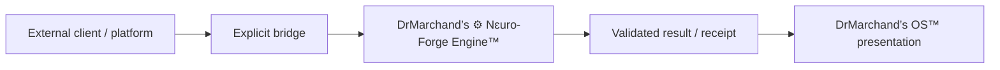

# DrMarchand’s ⚙︎ Nɛuro-Forge Engine™ - Public API Specifications

> Release-safe API, bridge, and protocol documentation for Engine-adjacent interfaces; this repository is not itself a live production runtime.

**Repository coordinate:** `DrMarchand-Library/api` · **Public** · **Specification and boundary surface**

## Quick start

Clone the repository and run the public privacy lint before publishing documentation changes. No live API server start command is claimed by this repository.

## Library map

| Need | Source |
| --- | --- |
| Public-data rules | [`PUBLIC_DATA_BOUNDARY.md`](PUBLIC_DATA_BOUNDARY.md) |
| Protocol material | [`MMS.md`](MMS.md) |
| Bridge documentation | [`docs/discord-github-bridge.md`](docs/discord-github-bridge.md) |
| Interface specifications | [`docs/specs/`](docs/specs/) |
| Privacy scan | [`scripts/public_privacy_lint.py`](scripts/public_privacy_lint.py) |
| Rights | [`RIGHTS.md`](RIGHTS.md) |

## Commands

| Command | Effect | Source |
| --- | --- | --- |
| `python3 scripts/public_privacy_lint.py --root .` | Scan supported public text files for high-signal private-data and credential patterns | [`scripts/public_privacy_lint.py`](scripts/public_privacy_lint.py) |

## Validation

```bash
python3 scripts/public_privacy_lint.py --root .
```

A clean lint result is one boundary check, not proof that every security or privacy control is complete.

## API

This repository documents public interface and bridge specifications. It does not currently prove a live HTTP router, production endpoint, or deployment. Treat files under [`docs/specs/`](docs/specs/) as specifications unless separate runtime evidence establishes implementation.

## Configuration

Secret values are not configuration documentation. Public configuration examples, when needed, must use placeholders and remain inside the boundary defined by [`PUBLIC_DATA_BOUNDARY.md`](PUBLIC_DATA_BOUNDARY.md).

## Architecture boundary



External platforms remain outside the Engine. Bridges define the crossing. **DrMarchand’s OS™** presents and routes state; it is not another name for the Engine.

## Naming boundary

Current public documentation uses **DrMarchand’s OS™**. `Infinity OS` and `Infinite OS` are superseded aliases, not current system identities. Historical machine coordinates may remain where compatibility requires them.

## Authority and rights

**Legal and operating company:** Design Orchard LLC  
**Operating environment:** 🔬 DrMarchand’s Lab⚛︎ratory™

See [`LICENSE`](LICENSE) and [`RIGHTS.md`](RIGHTS.md). Runtime, deployment, security, and completion claims require evidence beyond repository presence.
